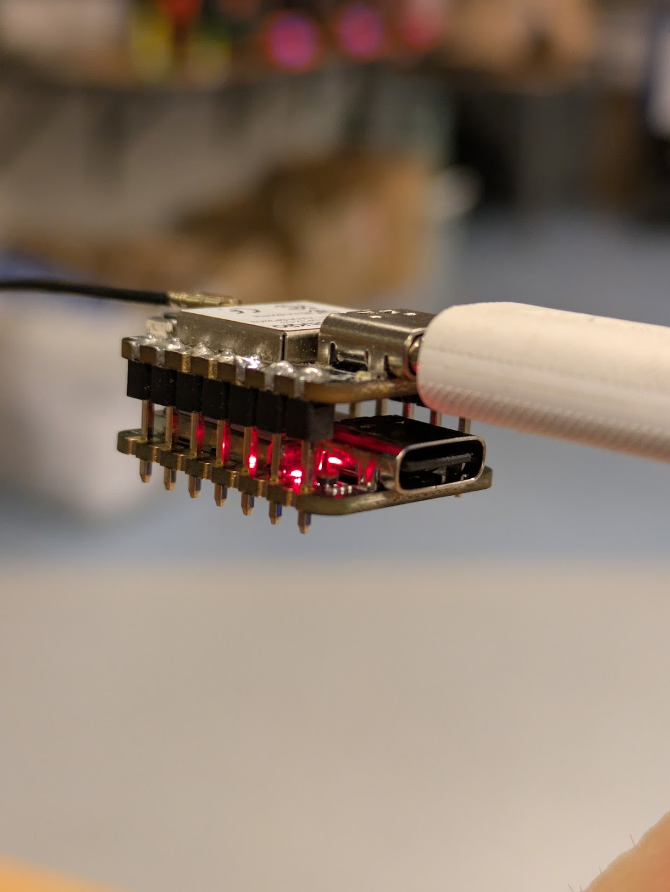
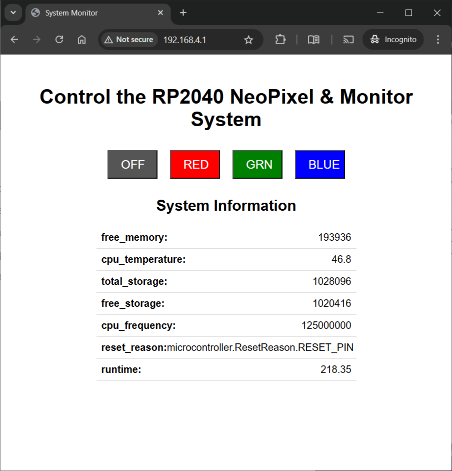

# ESP32C3RP2040

Seeed Studio Xiao RP2040 "with WiFi and Bluetooth"

## Because reaseons

Switched uart pins on one device so they can be stacked and communicate. 

PlatformIO project within VSCode and Circuitpython on the RP2040. 

Below is the basic interface, showing commands from ESP32C3 to RP2040 and live data from RP2040 on ESP32C3. 

